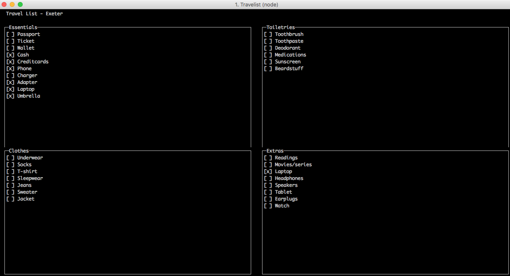

# Travel

Travel is a CLI travel checklist tool (in a very alpha state). 

I wanted to play with [blessed](https://github.com/chjj/blessed) and [react-blessed](https://github.com/Yomguithereal/react-blessed) and YOLO, right? 

Set it up with yarn/npm install and then

`npm start <traveldestination>`

